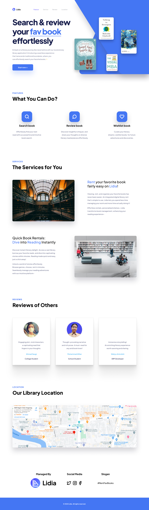

###

<h1 align="center">👋 Hey. Nice to see you.</h1>

###
<h3>Welcome to my page!   I'm Pol, junior web developer. Here, you can see my latest projects. </h3>
<h4>Things I code with</h4>

<!--    -->
  
  
  
  
  
<!--    -->
<!--    -->
  
  
  

<table style="max-width: 846px">
    <tr>
        <td style="max-width: 423px; vertical-align: top; max-width: 50%;" valign="top">
          <h3>Lidia</h3>
<!-- LIDIA -->
<table style="max-width=423px">
    <tr>
        <td  style="vertical-align: top; max-width: 50%;" valign="top">
            <h4>Technologies:</h4>
            

                
              
            

                

            <ul>
                <h4>Description:<h4>
                <li>A simple landing page.</li>
                <li>Practice in layout design.</li>
                <li>No responsive design included.</li>
                <li>Hover Effects</li>
            </ul>
        </td>
        <td  style=" max-width: 50%; vertical-align: top;" valign="top">
           
        </td>
    </tr>
</table>
        </td>
<!--   SUP -->
        <td  style="max-width: 423px; max-width: 50%; vertical-align: top;" valign="top">
          <h3>Sup</h3> 
          <table style="max-width=423px">
              <tr>
                  <td  style="vertical-align: top; max-width: 50%;" valign="top">
                      <h4>Technologies:</h4>
                      

                          
                        
                      

                          

                      <ul>
                          <h4>Description:<h4>
                          <li>A simple landing page.</li>
                          <li>Practice in layout design.</li>
                          <li>Hover Effects</li>
                          <li>No responsive design included.</li>
                      </ul>
                  </td>
                  <td  style=" max-width: 50%;" valign="top">
                     
                  </td>
              </tr>
          </table>
        </td>
    </tr>
</table>

