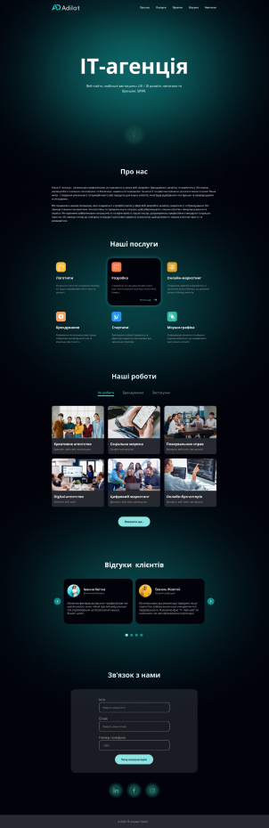
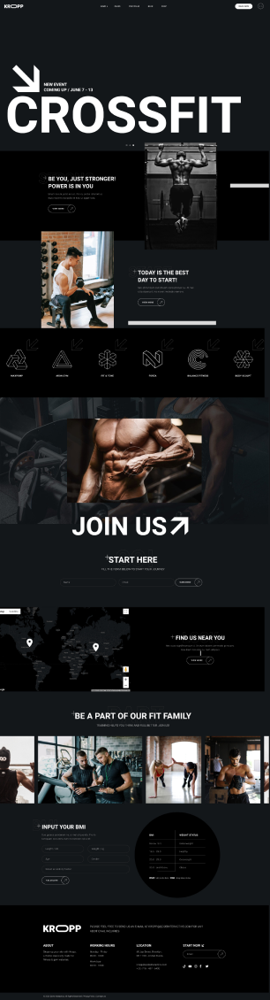
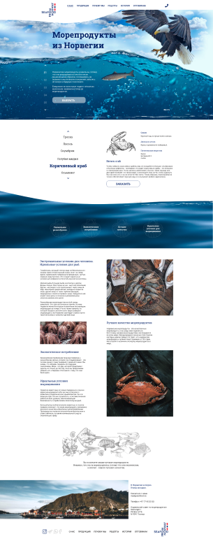
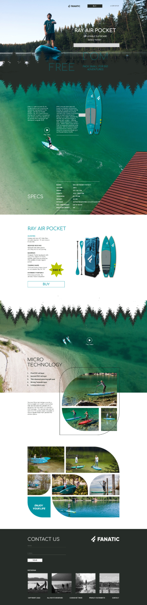

###

<h1 align="center">👋 Hey. Nice to see you.</h1>

###
<h3>Welcome to my page!   I'm Pol, junior web developer. Here, you can see my latest projects. </h3>
<h4>Things I code with</h4>

<!--    -->
  
  
  
  
  
<!--    -->
<!--    -->
  
  
  

<h3>Positivus</h3>
<table>
    <tr>
        <td valign="top" style="vertical-align: top;">
            <h4>Technologies:</h4>
            

              
              
              
              
            

                

            <ul>
                <h4>Description:<h4>
                <li>Responsive design to 320px</li>
                <li>Menu Item Activation on Scroll</li>
                <li>Form validation</li>
                <li>Sticky Header</li>
                <li>Hover Effects</li>
                <li>Slider</li>
            </ul>
        </td>
        <td style="margin-left: 200px;">
           
        </td>
    </tr>
</table>

<h3>Crossfit</h3>
<table>
    <tr>
        <td valign="top" style="vertical-align: top;">
            <h4>Technologies:</h4>
            

              
              
              
              
            

                

            <ul>
                <h4>Description:<h4>
                <li>Menu Item Activation on Scroll</li>
                <li>Sticky Header</li>
                <li>Element Sorting</li>
                <li>Hover Effects</li>
                <li>Slider</li>
                <li>No responsive design included.</li>
            </ul>
        </td>
        <td style="margin-left: 200px;">
           
        </td>
    </tr>
</table>

<h3>Crossfit</h3>
<table>
    <tr>
        <td valign="top">
            <h4>Technologies:</h4>
            

                
              
            

                

            <ul>
                <h4>Description:<h4>
                <li>A simple landing page.</li>
                <li>Practice in layout design.</li>
                <li>Hover Effects</li>
                <li>No responsive design included.</li>
            </ul>
        </td>
        <td >
           
        </td>
    </tr>
</table>

<h3>SeaFood</h3>
<table>
    <tr>
        <td valign="top" style="vertical-align: top;">
            <h4>Technologies:</h4>
            

                
                
            

                

            <ul>
                <h4>Description:<h4>
                <li>A simple landing page.</li>
                <li>Practice in layout design.</li>
                <li>Slider</li>
                <li>No responsive design included.</li>
            </ul>
        </td>
        <td style="margin-left: 200px;">
           
        </td>
    </tr>
</table>

<h3>Lidia</h3>
<table>
    <tr>
        <td  style="vertical-align: top; max-width: 300px;" valign="top">
            <h4>Technologies:</h4>
            

              
              
            

                

            <ul>
                <h4>Description:<h4>
                <li>A simple landing page.</li>
                <li>Practice in layout design.</li>
                <li>No responsive design included.</li>
                <li>Hover Effects</li>
            </ul>
        </td>
        <td valign="top">
           
        </td>
    </tr>
</table>

 <h3>Sup</h3> 
    <table>
        <tr>
            <td  valign="top">
                <h4>Technologies:</h4>
                

                    
                  
                

                    

                <ul>
                    <h4>Description:<h4>
                    <li>A simple landing page.</li>
                    <li>Practice in layout design.</li>
                    <li>Hover Effects</li>
                    <li>No responsive design included.</li>
                </ul>
            </td>
            <td   valign="top">
               
            </td>
        </tr>
    </table>

<table style="max-width: 846px">
    <tr>
        <td style="vertical-align: top; max-width: 423px;" valign="top">
<!-- LIDIA -->
        </td>
<!--   SUP -->
        <td  style="max-width: 423px; max-width: 50%; vertical-align: top;" valign="top">
        </td>
    </tr>
</table>

